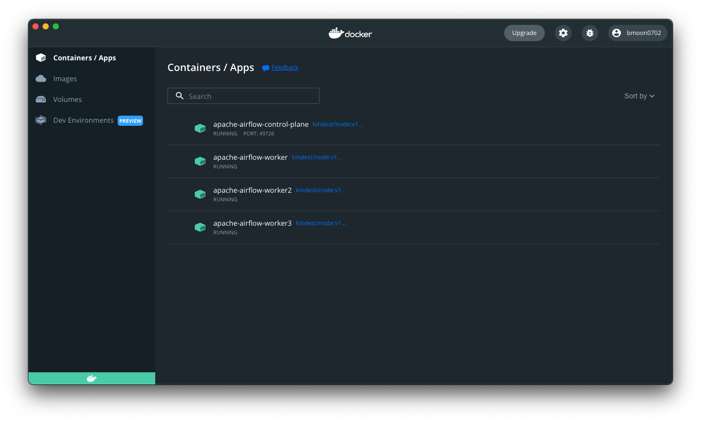

# how-to-kinD
## quick start
### install
```
brew install kind
```

### create a cluster
```
kind create cluster # Default cluster context name is `kind`
...
kind create cluster --name apache-airflow
kind create cluster --name apache-spark
```

### list cluster
```
kind get clusters
```

### delete cluster
```
kind delete cluster 

# if the flag `--name` is not specified, kind will use the default cluster context name `kind` and delete that cluster


kind delete cluster --name apache-airflow

```

### configuring kind cluster + create cluster from a config file
```
kind create cluster --config kind-example-config.yaml --name apache-airflow
```
```
# three node (two workers) cluster config
# kind-example-config.yaml

kind: Cluster
apiVersion: kind.x-k8s.io/v1alpha4
nodes:
- role: control-plane
- role: worker
- role: worker
- role: worker
```

### sample
```
how-to-kinD on  main 
❯ kind create cluster --config kind-example-config.yaml --name apache-airflow 
Creating cluster "apache-airflow" ...
 ✓ Ensuring node image (kindest/node:v1.23.4) 🖼 
 ✓ Preparing nodes 📦 📦 📦 📦  
 ✓ Writing configuration 📜 
 ✓ Starting control-plane 🕹️ 
 ✓ Installing CNI 🔌 
 ✓ Installing StorageClass 💾 
 ✓ Joining worker nodes 🚜 
Set kubectl context to "kind-apache-airflow"
You can now use your cluster with:

kubectl cluster-info --context kind-apache-airflow

Have a question, bug, or feature request? Let us know! https://kind.sigs.k8s.io/#community 🙂
```
```
❯ kubectl cluster-info --context kind-apache-airflow
Kubernetes control plane is running at https://127.0.0.1:50230
CoreDNS is running at https://127.0.0.1:50230/api/v1/namespaces/kube-system/services/kube-dns:dns/proxy

To further debug and diagnose cluster problems, use 'kubectl cluster-info dump'.
```
```
❯ kind get clusters
apache-airflow
```

